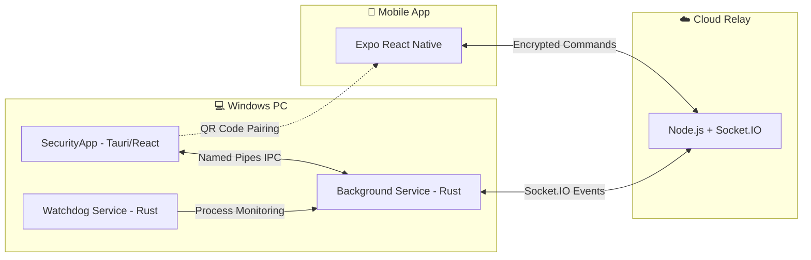

<div align="center">
  <h1>🛡️ Security System Architecture</h1>
  <p>A comprehensive, robust, and highly-optimized remote security and administration system designed for Windows PCs, controllable entirely via a Mobile App.</p>
</div>

---

## 🌟 Overview

This project is a multi-layered security system that allows users to remotely control, monitor, and secure their Windows machines through a dedicated mobile application. It leverages a lightweight Rust service running in the background, minimizing CPU and RAM overhead, while providing instantaneous WebSocket-based communication through a cloud relay.

### Core Features
- **⚡ Remote PC Lock & Control**: Lock your PC screen instantly from anywhere.
- **🛡️ USB Port Blocking**: Prevent unauthorized physical data access by disabling USB mass storage devices.
- **📸 Stealth Camera Capture**: Remotely trigger the webcam to take silent snapshots and securely send them to your mobile app.
- **🛑 Secure Service Hibernation (OTP)**: Suspend the background service to save resources via a secure 6-digit OTP verified between the PC and Mobile App.
- **☁️ Seamless OTA Updates**: Hot-update the background services without ever needing to uninstall or manually disrupt the system operations.
- **📱 QR Code Pairing**: Easy and secure zero-config pairing between the Mobile App and the PC using QR codes.

---

## 🏗️ System Architecture & Data Flow

The system consists of 4 highly decoupled modules:



1. **`Service` (Rust)**: The core engine. Runs as a `NT AUTHORITY\SYSTEM` service. It maintains a persistent Websocket connection to the Cloud Relay, executes hardware-level commands, and exposes a Named Pipe for the PC UI.
2. **`SecurityApp` (Tauri + React)**: The local management dashboard. Used strictly for initial setup, QR code pairing, generating OTPs, and triggering OTA updates.
3. **`ControlApp` (React Native / Expo)**: The remote control center. Allows the user to monitor activity logs and send security commands on the go.
4. **`Cloud` (Node.js + Express)**: A lightweight, stateless intermediary router that bridges the Mobile App and the Windows Service. It also hosts static binaries for OTA (Over-the-Air) updates.

---

## 🚀 Installation & Setup Guide

Follow these steps to deploy the entire security suite from scratch.

### 1. Deploy the Cloud Relay
1. Navigate to the `Cloud` directory.
2. Deploy this folder to a Node.js hosting provider (e.g., [Render](https://render.com), Heroku, or an AWS EC2 instance).
3. Once deployed, note down your server URL (e.g., `https://my-security-relay.onrender.com`).

### 2. Build the PC Installer
For maximum convenience, an automated build pipeline is provided. You need **Rust**, **Node.js**, and **Tauri CLI** installed on your machine.

1. Double-click the `build.bat` file located in the root of the project.
2. The script will automatically compile the Rust services (`--release`), build the Tauri UI, and package everything into a single `Security_Installer.zip` archive.
3. Extract `Security_Installer.zip` and run `installer/install.bat` **as Administrator**.
4. The system will automatically register the services and launch the PC UI.

### 3. Setup the Mobile App
1. Navigate to the `ControlApp` directory.
2. Install dependencies:
   ```bash
   npm install
   ```
3. Start the Expo development server:
   ```bash
   npx expo start
   ```
4. Use the **Expo Go** app on your iOS or Android device to scan the QR code shown in your terminal. *(Alternatively, use EAS Build to generate a standalone `.apk` or `.ipa`)*.

### 4. Pairing & Usage
1. Open the **Security App** on your Windows PC.
2. Ensure the "Server Relay URL" field matches your deployed Cloud Relay URL.
3. Open the Mobile App, log in, and click **Scan QR to Pair**.
4. Point your phone camera at the QR code displayed on the PC screen.
5. **Done!** Your devices are securely paired. You can now remotely lock the PC, disable USB ports, or take stealth photos.

---

## 🛠️ Developer Commands

- **OTA Updates**: Compile new `.exe` files in `Service`, place them in `Cloud/public/updates/`, increment the `version.json`, and push to your server. Users can update via a single click in the PC UI.
- **Service Logs**: Debug logs for the Windows Service can be found at `C:\Windows\Temp\security_service.log`.

<br/>
<div align="center">
  <i>Engineered for Security, Optimized for Performance</i>
</div>
